# Sistema Academico UTA — Arbol Binario de Busqueda en Java

**Asignatura:** Estructura de Datos  
**Universidad:** Universidad Tecnica de Ambato  
**Tema:** Arboles binarios, recorridos y aplicacion practica  
**Lenguaje:** Java (POO)

---

## Descripcion

Sistema academico que gestiona estudiantes mediante un **Arbol Binario de Busqueda (BST)**.  
Cada estudiante contiene: cedula (clave), apellidos, nombres, nota final, carrera y nivel.  
La cedula es la clave de comparacion del BST (orden lexicografico).

---

## Estructura del proyecto

```
prueba-practica-arboles-cpp-java/
└── java/
    ├── Estudiante.java   # Modelo de datos del estudiante
    ├── Nodo.java         # Nodo del arbol BST
    ├── ArbolBST.java     # Logica del arbol (insertar, buscar, eliminar, recorridos...)
    └── Main.java         # Punto de entrada — menu interactivo
```

---

## Compilacion y ejecucion

### Requisitos
- Java JDK 17 o superior  
- Terminal / CMD

### Pasos

```bash
# 1. Entrar a la carpeta del proyecto
cd java/

# 2. Compilar todos los archivos
javac *.java

# 3. Ejecutar
java Main
```

---

## Funciones implementadas

| Funcion | Descripcion |
|---|---|
| `insertarEstudiante()` | Inserta un nodo nuevo en el BST segun la cedula |
| `buscarEstudiante()` | Busqueda O(log n) por cedula |
| `eliminarEstudiante()` | Eliminacion con los 3 casos del BST (hoja, 1 hijo, 2 hijos) |
| `recorridoInorden()` | Iz → Raiz → Der (lista ordenada por cedula) |
| `recorridoPreorden()` | Raiz → Iz → Der |
| `recorridoPostorden()` | Iz → Der → Raiz |
| `recorridoPorNiveles()` | BFS con Queue — muestra nivel por nivel |
| `contarNodos()` | Cuenta total de estudiantes (recursivo) |
| `calcularAltura()` | Altura del arbol en niveles (recursivo) |
| `buscarNotaMayor()` | Recorre todo el arbol buscando la nota mas alta |
| `buscarNotaMenor()` | Recorre todo el arbol buscando la nota mas baja |
| `mostrarAprobados()` | Estudiantes con nota >= 7.0 |
| `mostrarReprobados()` | Estudiantes con nota < 7.0 |

---

## Menu del sistema

```
╔══════════════════════════════════════════════╗
║   SISTEMA ACADEMICO — UNIVERSIDAD TEC. AMBATO  ║
╠══════════════════════════════════════════════╣
║  1.  Insertar estudiante                     ║
║  2.  Buscar estudiante por cedula            ║
║  3.  Eliminar estudiante                     ║
║  4.  Recorrido Inorden                       ║
║  5.  Recorrido Preorden                      ║
║  6.  Recorrido Postorden                     ║
║  7.  Recorrido por niveles (BFS)             ║
║  8.  Contar estudiantes                      ║
║  9.  Calcular altura del arbol               ║
║  10. Mostrar estudiante con mayor nota       ║
║  11. Mostrar estudiante con menor nota       ║
║  12. Mostrar estudiantes aprobados           ║
║  13. Mostrar estudiantes reprobados          ║
║  14. Salir                                   ║
╚══════════════════════════════════════════════╝
```

---

## Capturas de ejecucion

### Menu principal

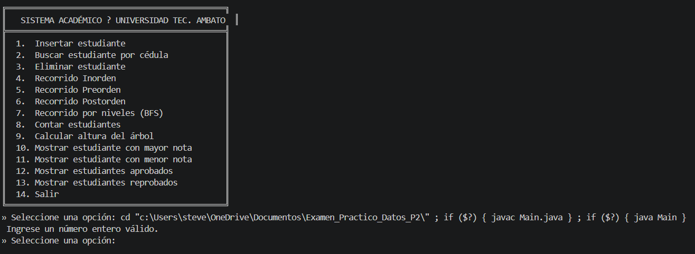

### Carga de datos de prueba

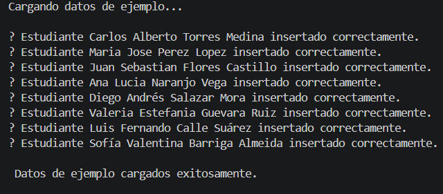

### Opcion 1 — Insertar estudiante

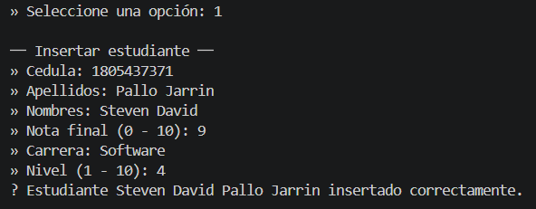

### Opcion 2 — Buscar estudiante por cedula

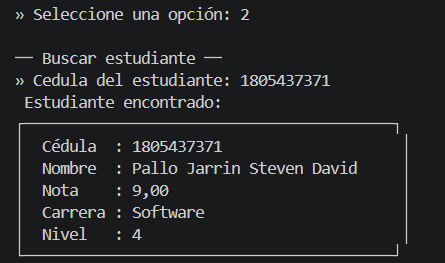

### Opcion 3 — Eliminar estudiante

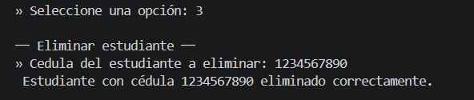

### Opcion 4 — Recorrido Inorden

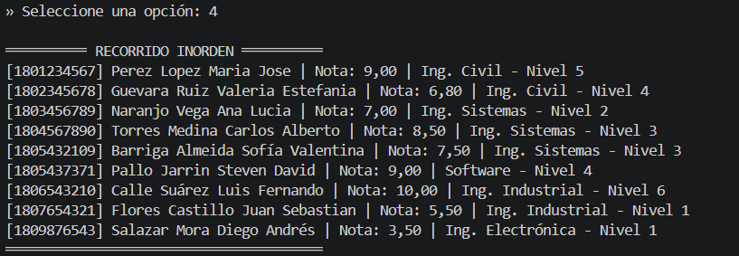

### Opcion 5 — Recorrido Preorden

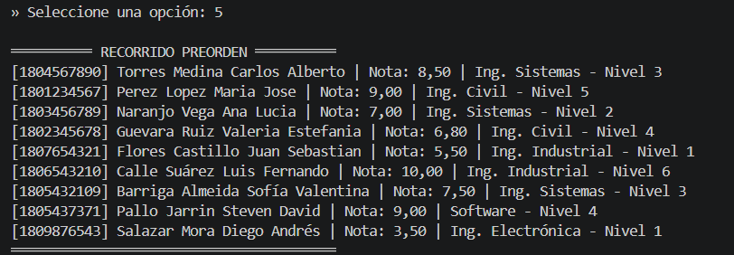

### Opcion 6 — Recorrido Postorden

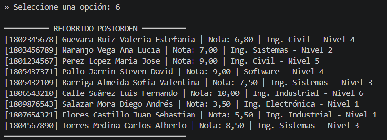

### Opcion 7 — Recorrido por niveles (BFS)

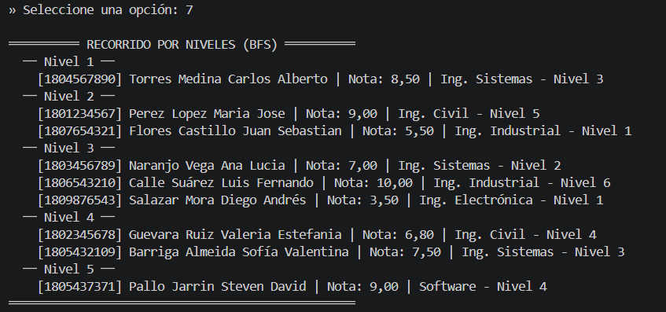

### Opcion 8 — Contar estudiantes

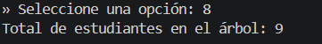

### Opcion 9 — Calcular altura del arbol

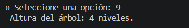

### Opcion 10 — Estudiante con mayor nota

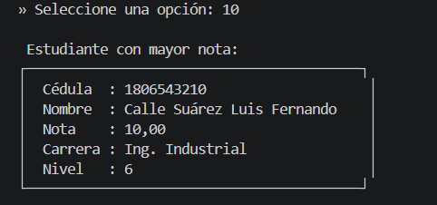

### Opcion 11 — Estudiante con menor nota

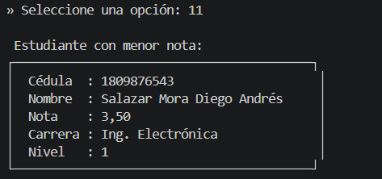

### Opcion 12 — Estudiantes aprobados

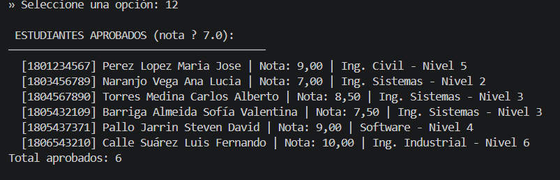

### Opcion 13 — Estudiantes reprobados

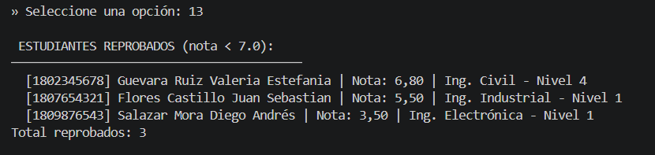

### Opcion 14 — Salir

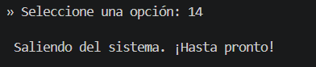

---

## Conceptos tecnicos aplicados

- **Arbol Binario de Busqueda (BST):** insercion, busqueda y eliminacion O(log n)
- **Recursividad:** todos los recorridos y funciones avanzadas usan recursion
- **BFS con Queue:** `recorridoPorNiveles()` usa `java.util.LinkedList` como cola
- **POO:** clases `Estudiante`, `Nodo`, `ArbolBST` y `Main` desacopladas
- **Validacion de datos:** cedula de 10 digitos, nota 0-10, nivel 1-10
- **Eliminacion de 3 casos:**
  1. Nodo hoja → se elimina directamente
  2. Un solo hijo → se reemplaza con el hijo
  3. Dos hijos → se busca el sucesor inorden (minimo del subarbol derecho)

---

## Autor

Estudiante — Universidad Tecnica de Ambato  
Asignatura: Estructura de Datos
